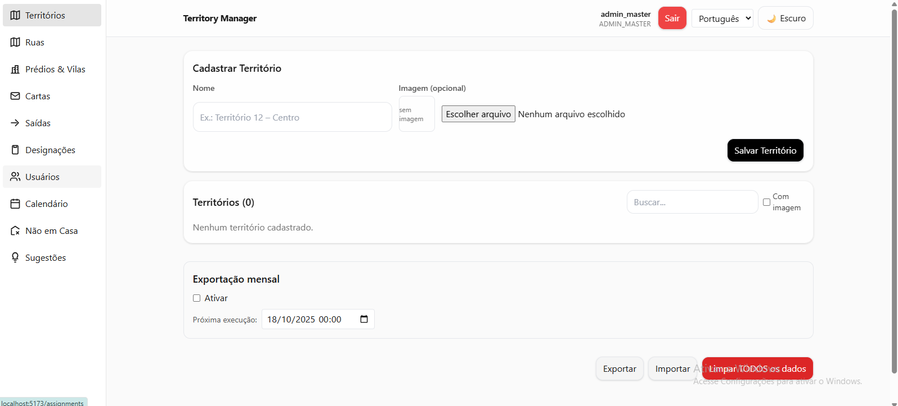
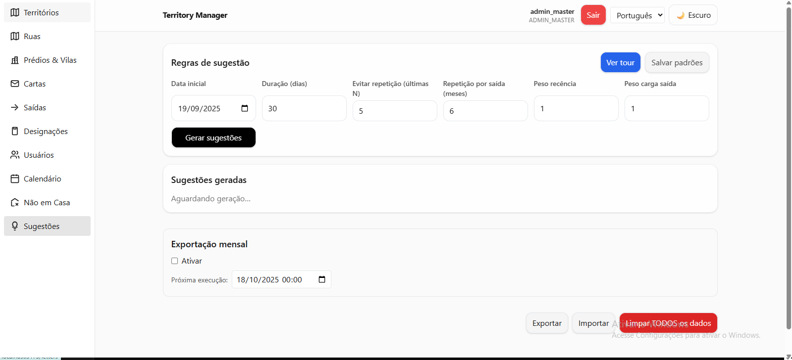
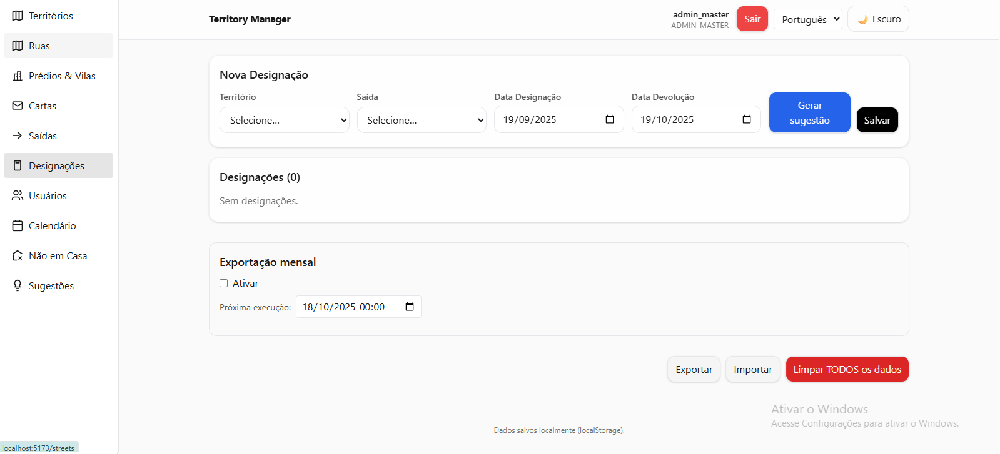
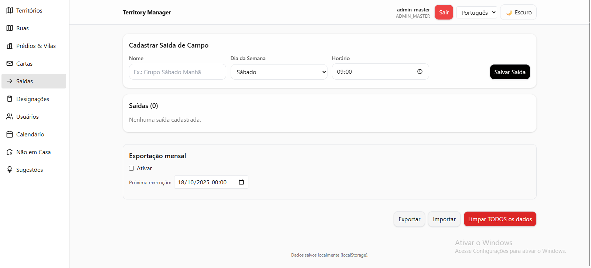
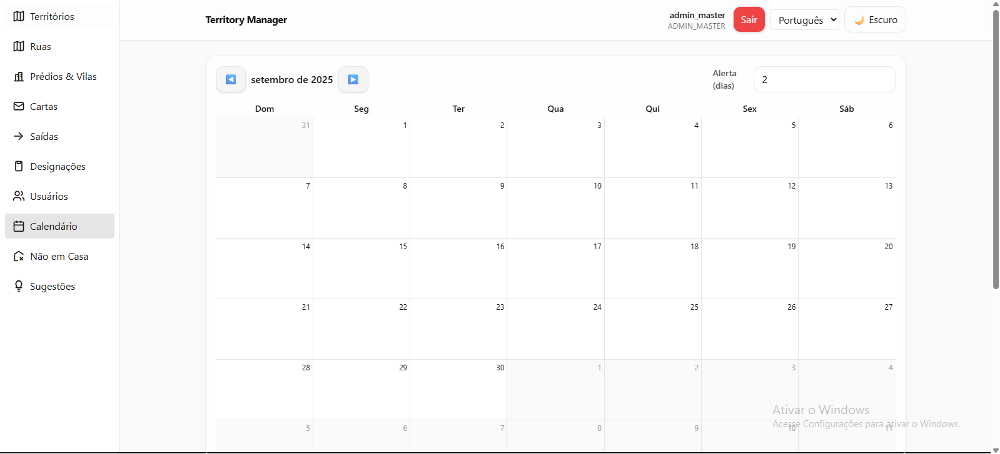
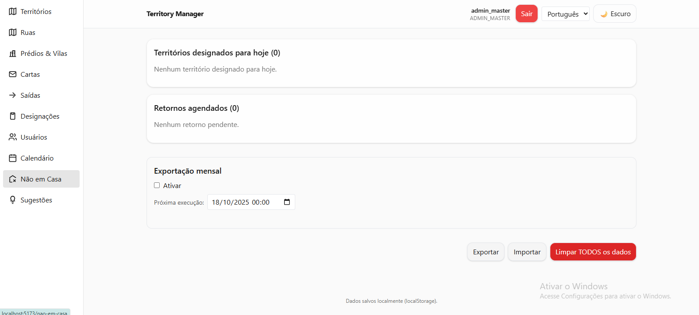

# Territory Manager

[](LICENSE)
[](https://nodejs.org)
[](https://react.dev/)
[](https://vitejs.dev/)
[](https://tailwindcss.com/)
[](https://github.com/leocosta1/territory-manager-vite/search?l=typescript)
[](CONTRIBUTING.md)
[](https://prettier.io)

Gerencie territórios, saídas e designações de forma offline.

## Descrição

Aplicação SPA para organizar **Territórios**, **Saídas de Campo**, **Designações** e **Sugestões**. Tudo salvo localmente no `IndexedDB` (via [Dexie.js](https://dexie.org)), sem necessidade de backend.

### Principais Recursos

- Cadastrar **Territórios** (nome e imagem opcional)
- Cadastrar **Saídas de Campo** (dia da semana, nome e horário)
- Registrar **Designações** (território, saída, datas de designação e devolução)
- Gerar **Sugestões** evitando repetição por N meses e com duração padrão em dias

## Requisitos

- [Node.js](https://nodejs.org) \>= 18
- Windows, macOS ou Linux
- Dependências-chave: React, Vite e Tailwind CSS

## Instalação

1. Clone o repositório.
2. Instale as dependências com `npm install`.
3. Inicie o servidor de desenvolvimento usando `npm run dev`.

Para um passo a passo completo, consulte o [guia de instalação](docs/installation.md).

## Uso

```bash
npm run dev
# abra http://localhost:5173 no navegador
```

Resultado esperado: a aplicação carregará no navegador permitindo gerenciar territórios e designações.

## Configuração

Atualmente não há variáveis de ambiente obrigatórias. Caso precise, crie um arquivo `.env` e defina variáveis como:

```bash
EXAMPLE_API_KEY="sua_chave_aqui"
```

Para habilitar a comunicação com um backend de notificações, configure também:

```bash
VITE_NOTIFICATIONS_API_URL="https://sua-api.com"
```

Quando essa variável não estiver definida, as notificações de devolução permanecerão apenas no modo offline.

As credenciais padrão do usuário administrador podem ser personalizadas com as variáveis abaixo:

```bash
VITE_ADMIN_MASTER_NAME="Nome exibido"
VITE_ADMIN_MASTER_EMAIL="admin@exemplo.com"
VITE_ADMIN_MASTER_PASSWORD="sua_senha_segura"
```

Por padrão o usuário `admin_master` é criado com a senha `assigna123`. Recomenda-se alterar essas credenciais em produção.

## Autenticação

- O login requer um identificador (ID do usuário ou e-mail) e senha.
- Um usuário inicial `admin_master` é criado automaticamente para acesso administrativo.
- A senha padrão é `assigna123` e pode ser ajustada pelas variáveis de ambiente listadas acima.
- As senhas são armazenadas como hash SHA-256 e podem ser atualizadas ao editar o usuário em **Usuários**.

## Internacionalização (i18n)

- Idiomas suportados: `en-US`, `pt-BR` e `es-ES`.
- O idioma selecionado persiste em `localStorage` sob a chave `locale`.
- Seletor de idioma disponível na interface.
- Para adicionar um novo idioma:
  - Crie `src/locales/<codigo>/translation.json` (ex.: `fr-FR`).
  - Registre-o em `src/i18n.ts`.

## Ruas & Numerações

- Gerencie ruas, faixas de numeração e tipos de propriedade por território.
- Registre a **última visita bem-sucedida** e deixe que o sistema agende automaticamente o **próximo retorno**.
- Bloqueio (cooldown) de visitas após sucesso: padrão de 120 dias (ajustável em `src/constants/addresses.ts`). Enquanto o cooldown estiver ativo, o botão de "Marcar visita" permanece desabilitado e exibe a data prevista de liberação.
- Tabelas exibem o status de bloqueio, prazos e ações de acompanhamento diretamente na lista de endereços.
- Canvas de anotação da imagem do território (componente `src/components/ImageAnnotator.tsx`) para apoiar o mapeamento visual; cliques, cliques com o botão direito e cliques duplos disparam os callbacks configurados.

## Scripts

- `npm run dev` inicia o ambiente de desenvolvimento.
- `npm run build` gera o build de produção.
- `npm run preview` faz o preview do build.
- `npm run lint` roda ESLint.
- `npm run format` aplica Prettier.
- `npm test` executa a suíte de testes (Vitest).

## Testes

- Testes unitários com **Vitest** e ambiente **jsdom**.
- Mocks de IndexedDB com **fake-indexeddb**.

## Banco de Dados (Offline)

- Todos os dados são armazenados no **IndexedDB** via **Dexie.js** (`src/services/db.ts`).
- Migrações de esquema são aplicadas automaticamente ao abrir a aplicação. A versão atual é controlada pela constante `SCHEMA_VERSION`, definida em [`src/services/db.ts`](src/services/db.ts) (atualmente em 11).
- Campos de visitas em endereços: `lastSuccessfulVisit` e `nextVisitAllowed`.

## Screenshots

Adicione imagens em `docs/screenshots/` com os nomes abaixo (ou ajuste os caminhos conforme preferir):









## Suporte

Abra uma issue no [rastreador de problemas](../../issues) para relatar bugs ou solicitar recursos.

## Contribuição

Contribuições são bem-vindas! Veja as diretrizes em [CONTRIBUTING.md](CONTRIBUTING.md) e o [Código de Conduta](CODE_OF_CONDUCT.md).

## Licença

Distribuído sob a licença [MIT](LICENSE).
